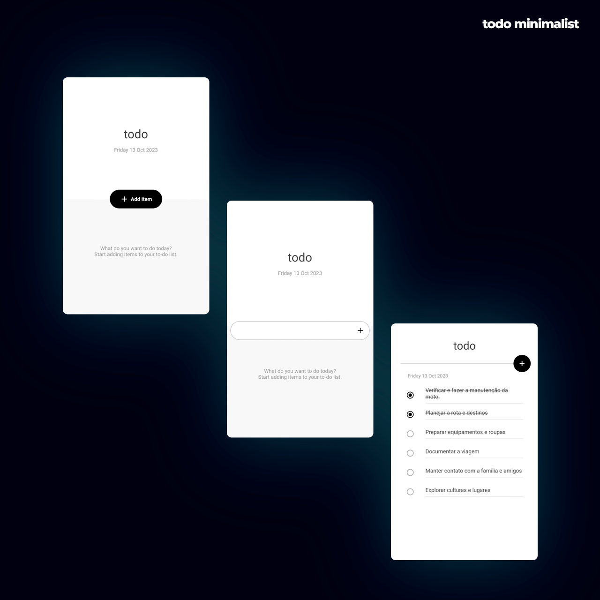

# 📱 To-Do List App em Flutter

Neste projeto, desenvolvemos um aplicativo de lista de tarefas (To-Do List) usando Flutter, uma tecnologia poderosa para criação de aplicativos móveis multiplataforma. Este aplicativo permite aos usuários criar, gerenciar e marcar tarefas como concluídas.

## 📋 Funcionalidades Principais

- **Adicionar Tarefas**: Os usuários podem adicionar novas tarefas à lista.
- **Marcar Tarefas como Concluídas**: Tarefas podem ser marcadas como concluídas.
- **Excluir Tarefas**: Os usuários podem remover tarefas da lista.
- **Design Amigável**: Interface de usuário (UI) intuitiva e fácil de usar.

## 🔧 Tecnologias Utilizadas

- **Flutter**: SDK open-source para criação de aplicativos móveis nativos para iOS e Android a partir de um único código-fonte.
- **Dart**: Linguagem otimizada para desenvolvimento mobile, desktop e web.
- **Material Design (flutter/material.dart)**: Conjunto de widgets do Flutter que implementa as diretrizes de design material.

## ⚙️ Como Executar o Projeto

Siga estas etapas simples para executar o projeto em seu ambiente de desenvolvimento:

1. Clone o repositório: `git clone https://github.com/loandre/ToDoApp.git`.
2. Navegue até o diretório do projeto: `cd ToDoApp`.
3. Instale as dependências: `flutter pub get`.
4. Inicie o aplicativo: `flutter run`.

## 🚀 Próximos Passos

Este projeto é um ponto de partida para a criação de um aplicativo de lista de tarefas mais robusto e completo. Aqui estão alguns próximos passos a serem construidos:

- **Categorias de Tarefas**: Adicionar a capacidade de categorizar tarefas para melhor organização.
- **Data de Vencimento**: Permitir que os usuários definam datas de vencimento para suas tarefas.
- **Lembretes**: Implementar lembretes para tarefas importantes.

## ✨ Agradecimentos

Agradeço ao professor José Daniel por propor este desafio e à LDC Serviços de Mídia Ltda por proporcionar essa oportunidade desafiadora, que certamente ampliou meus horizontes no mundo da programação.
